# Truss

Production-grade Kubernetes desktop for operators who want a fast GUI without giving up terminal habits.

Truss is a local-first Electron + Go desktop app for Kubernetes cluster navigation and day-to-day operations. It emphasizes safety (read-only by default), local credential protection (encrypted vault), and high-signal workflows for engineers working across multiple clusters.

## Why Truss

- Safe by default: mutation workflows are gated behind an explicit Write mode toggle.
- Local-first security: kubeconfigs and profiles are stored in an encrypted local vault.
- Fast navigation: three-pane keyboard-driven workflow with search, breadcrumbs, and resource summaries.
- Operator workflows built in: logs, exec, file transfer, port-forwarding, YAML editing/diffing, and Helm release inspection.
- No cluster-side install required.

## Production Status

Truss is documented and packaged for production desktop use as of the `1.0.x` line.

What that means:
- Signed release tags and versioned release artifacts (with checksum verification guidance).
- CI coverage for backend tests, frontend unit tests, and Playwright smoke tests.
- Explicit security model and operational troubleshooting documentation.
- Backwards-compatible versioning expectations under SemVer for stable releases.

See:
- [Installation & Upgrade Guide](docs/INSTALL.md)
- [Operations & Troubleshooting](docs/OPERATIONS.md)
- [Security Policy](SECURITY.md)
- [Contributing](CONTRIBUTING.md)

## Feature Highlights

- Encrypted vault for contexts/profiles (`contexts.enc`) using Argon2id + AES-GCM or GPG.
- Read-only mode by default; high-visibility Write mode for mutations.
- Keyboard-first navigation with command palette, global search, and pane focus shortcuts.
- Cluster overview with readiness/health summaries and warning event signal filtering.
- Resource list + inspector views for data, YAML, events, and summaries.
- Popout session windows for logs, exec, file transfer, and port-forward management.
- Helm release browsing and operations (rollback/uninstall guarded by RO mode).
- Plugin system with local storage and secure encrypted plugin storage APIs.
- Theme support (`system`, built-in themes, plugins, and `user.css`).

## Screenshots

### Main Navigation and Resource Views

| Main | Global Search |
|---|---|
| 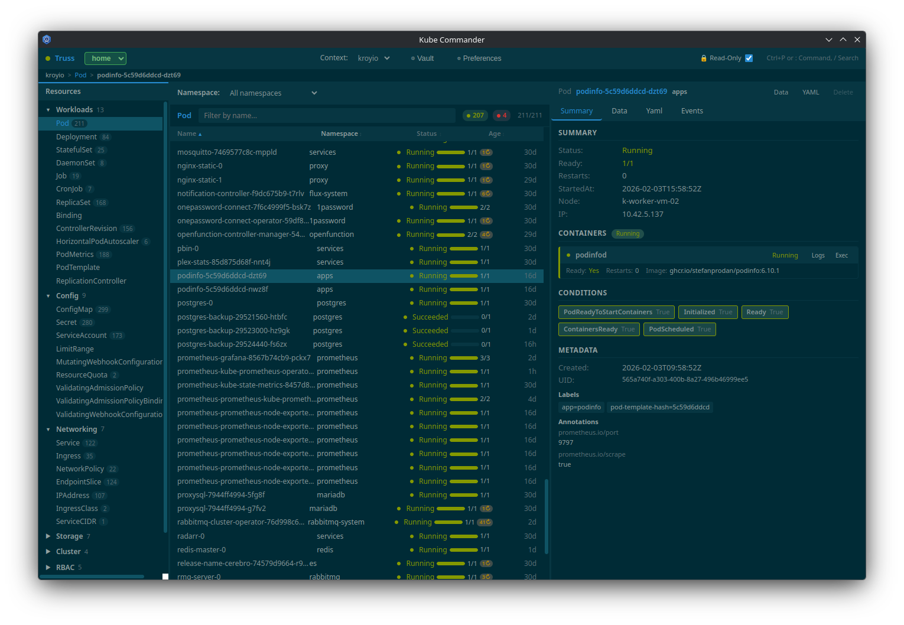 | 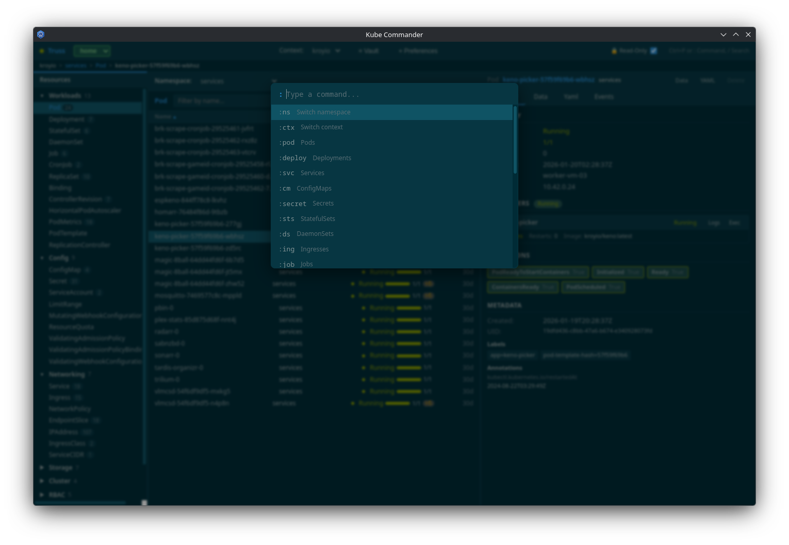 |

| Resource Data | Resource Events |
|---|---|
| 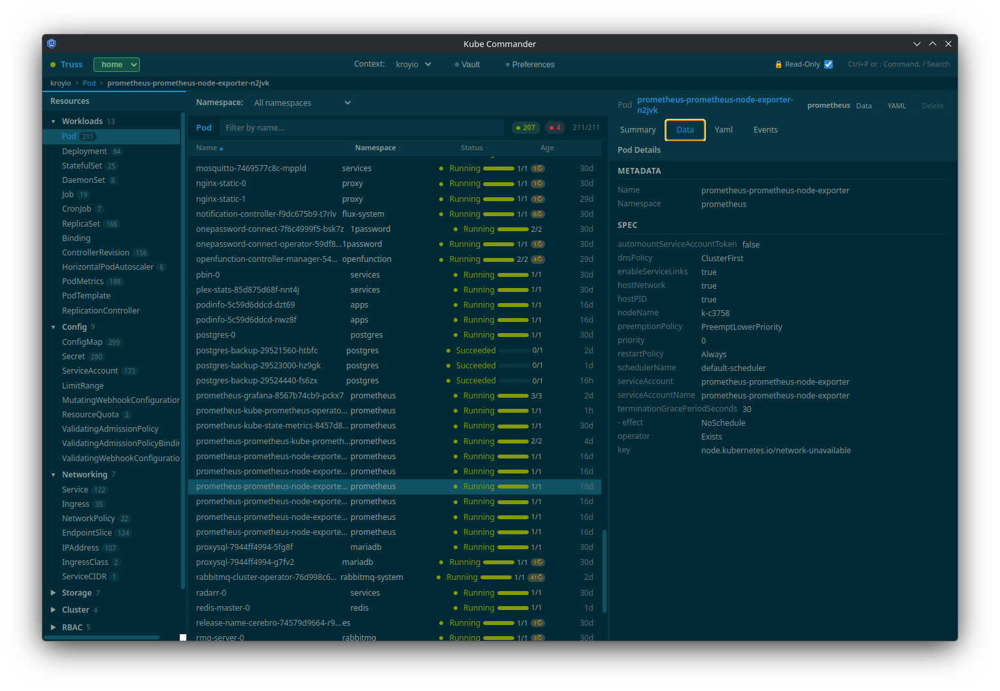 | 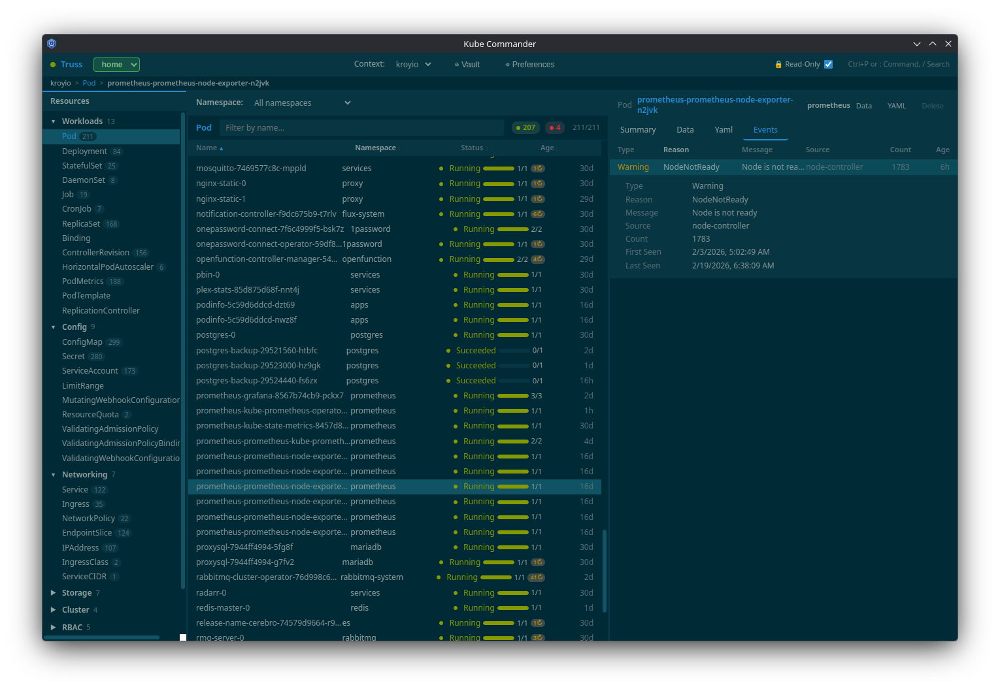 |

| YAML View | Write Mode Visibility |
|---|---|
| 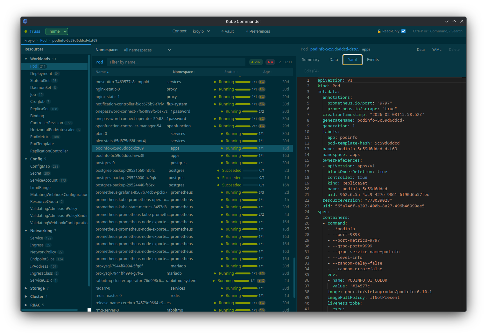 | 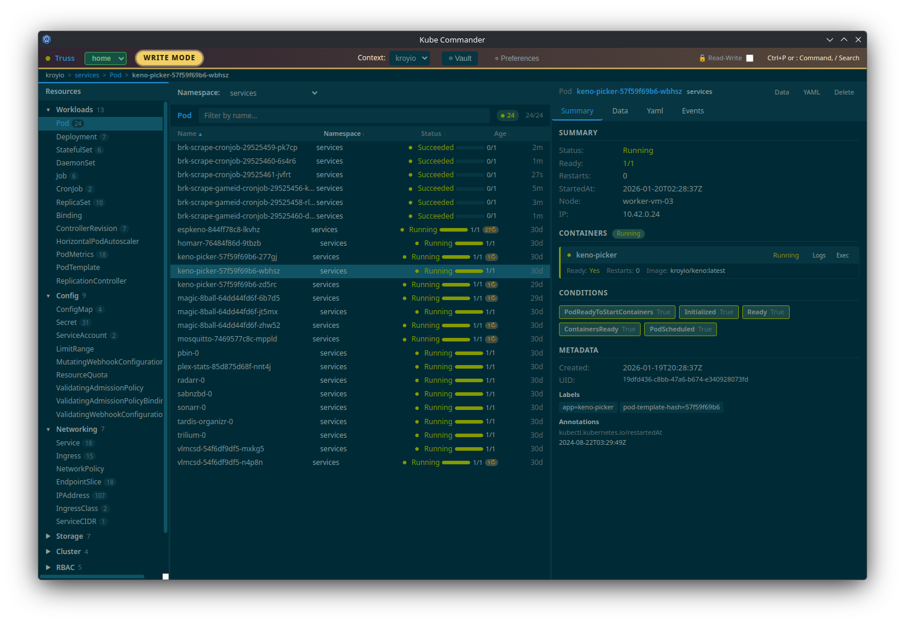 |

### Workflows and Operations

| Logs / Exec / File Transfer | Async Typeahead Search |
|---|---|
| 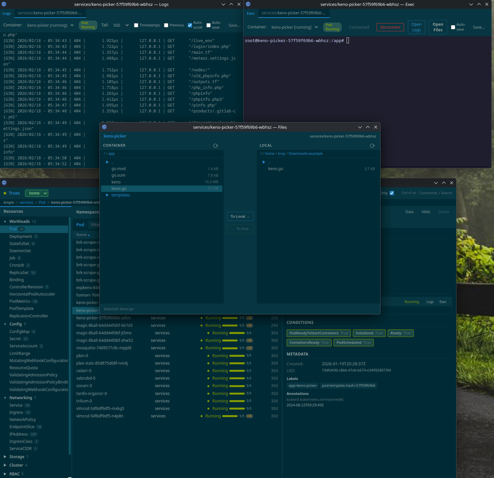 | 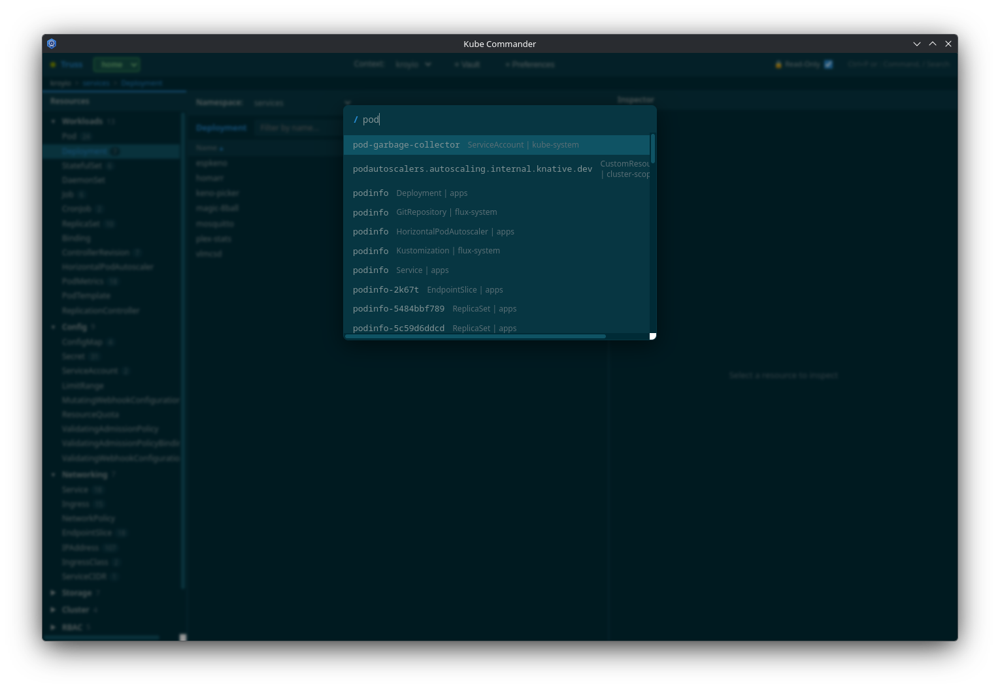 |

| Cluster Overview | Profiles |
|---|---|
| 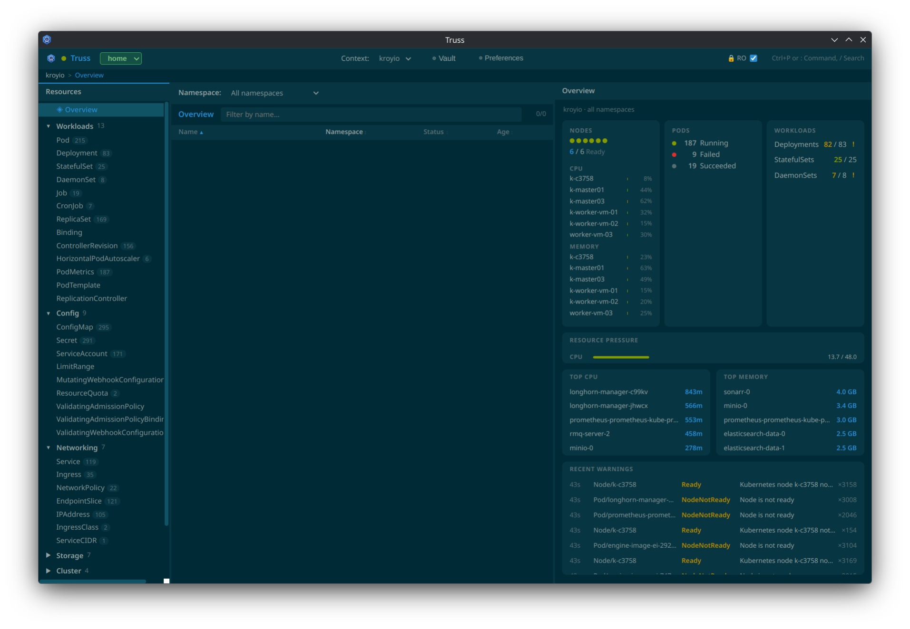 | 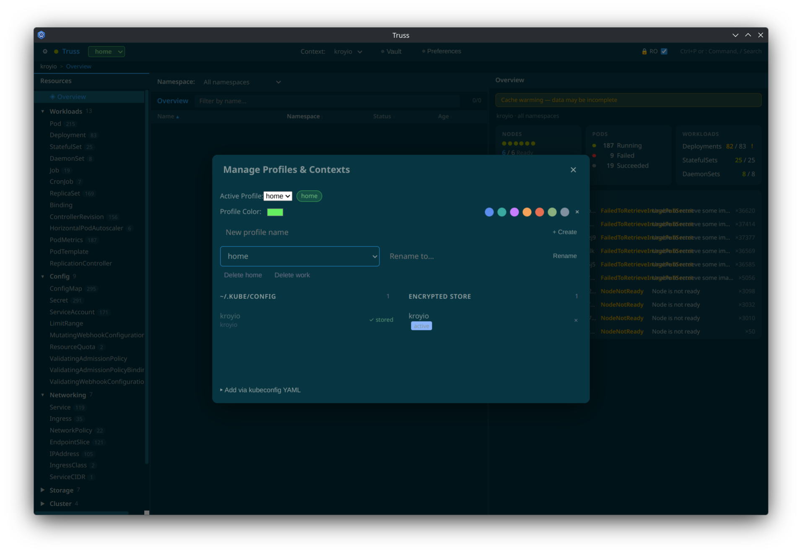 |

| Shortcuts Help (?) | |
|---|---|
| 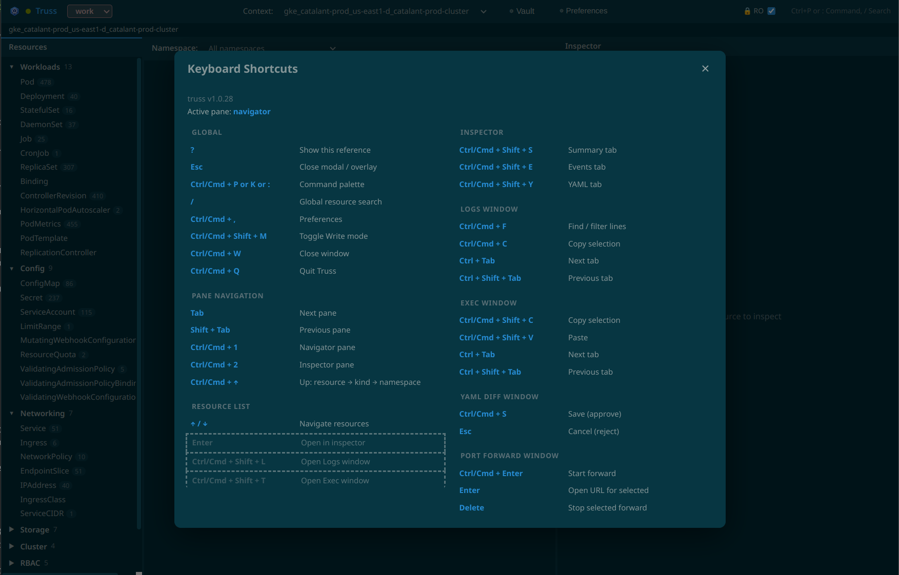 | |

## Quick Start (End Users)

1. Download a release from GitHub Releases for your OS/architecture.
2. Verify checksums/signatures (recommended for production use).
3. Install and launch Truss.
4. Initialize the encrypted vault (password or GPG).
5. Import contexts from `~/.kube/config` or paste kubeconfig YAML.
6. Confirm you are in `RO` mode before connecting to production clusters.

Full instructions:
- [docs/INSTALL.md](docs/INSTALL.md)

## Core Functionality

### Encrypted Context/Profile Vault

- First-run setup supports:
  - `password` mode: Argon2id-derived key + AES-256-GCM
  - `gpg` mode: system GPG key encryption
- Contexts, profile metadata, and active context are encrypted at rest.
- Context import from `~/.kube/config` or pasted kubeconfig YAML.
- Profile switching with per-profile context sets and color labels.

### Cluster Overview

- Selected automatically on first load; accessible via `◈ Overview`.
- Live node readiness, pod phase breakdown, and workload health summaries.
- Recent Kubernetes warning events with normalization and suppression controls.
- Cache-warming indicator when informer cache has not yet fully synced.
- Stream-first updates with polling fallback for resilience.

### Navigation and State

- Three-pane workflow:
  - left: resource navigator
  - middle: resource list
  - right: inspector
- Breadcrumb navigation (`context -> namespace -> kind -> resource`).
- Context/namespace navigation state cache for faster switching.
- Draggable pane splitters.

### Modify Mode Safety

- `RO` mode blocks mutating operations by default.
- `Write` mode is explicit and visually prominent.
- Mutating inspector/list actions are disabled in RO mode.
- Plugin `applyYaml()` is also blocked in RO mode.

### Resource and Workload Tooling

- Summary, Data/Form, YAML, and Events inspector tabs.
- Pod/workload health summaries and owned-pod drilldown.
- Logs window with filtering, timestamps, `previous`, local persistence option, and adaptive polling.
- Exec window with interactive terminal over WebSocket.
- File transfer window for upload/download/mkdir (POSIX shell-based in-container operations).
- Port-forward manager with lifecycle state, output logs, and lock-aware session handling.

### Helm

- Helm releases shown in navigation/list/inspector.
- Release summary, values, history, rollback, and uninstall (RO-guarded).

### Themes and Plugins

- Built-in and plugin-provided themes.
- Optional `user.css` overlay for custom styling.
- Privileged plugin model with local and secure encrypted storage APIs.

## Security Model (Summary)

Truss is designed for local desktop use on a trusted workstation. It is not a remote multi-user service.

- Backend daemon binds to `127.0.0.1` on an ephemeral port.
- Per-launch bearer token secures renderer/backend communication.
- WebSocket auth uses `Sec-WebSocket-Protocol` token header (no query-param token fallback).
- Electron renderer isolation and Chromium sandbox enabled.
- Transient browser storage is minimized and cache is disabled.
- Plugin code is privileged by design; install only trusted plugins.

Full details and disclosure policy:
- [SECURITY.md](SECURITY.md)

## Installation, Upgrade, and Verification

Release artifacts are produced for:
- Linux: AppImage (`x64`, `arm64`)
- macOS: DMG (`x64`, `arm64`)
- Windows: NSIS installer (`x64`, `arm64`)

Artifact naming (from build config):
- `truss-<version>-linux-<arch>.AppImage`
- `truss-<version>-macos-<arch>.dmg`
- `truss-<version>-windows-<arch>.exe`

Release verification (recommended):

```bash
# Import release signing key from this repository
gpg --import KEYS

# Optional fingerprint check
gpg --fingerprint CD786AF6C8054E3630457321899FF2FEE3CD9D96

# Verify signed checksum manifest
gpg --verify SHA256SUMS.asc SHA256SUMS

# Verify all artifact checksums
sha256sum -c SHA256SUMS
```

For OS-specific install/upgrade/uninstall steps, see [docs/INSTALL.md](docs/INSTALL.md).

## Storage Paths

Per-user app data directory:
- Linux/macOS: `~/.config/truss/`
- Windows: `%AppData%\\truss\\`

Typical files:
- `contexts.enc`
- `preferences.json`
- `user.css`
- `plugins/`
- `session-logs/` (only when explicitly enabled for session windows)
- `discovery-cache.json` (persisted discovery cache)

## Keyboard Shortcuts

Press `?` at any time to open the in-app shortcuts reference with context-aware highlighting.

### Global

| Key | Action |
|---|---|
| `?` | Open shortcuts/help modal |
| `Esc` | Close modal or overlay |
| `Cmd/Ctrl+,` | Open Preferences |
| `Cmd/Ctrl+Shift+M` | Toggle Modify mode (RO/Write) |
| `Cmd/Ctrl+W` | Close window |
| `Cmd/Ctrl+Q` | Quit Truss |

### Pane Navigation

| Key | Action |
|---|---|
| `Tab` / `Shift+Tab` | Cycle focus across panes |
| `Cmd/Ctrl+1` | Focus Navigator pane |
| `Cmd/Ctrl+2` | Focus Inspector pane |
| `Cmd/Ctrl+↑` | Navigate up (resource → kind → namespace) |

### Command Palette and Search

| Key | Action |
|---|---|
| `Cmd/Ctrl+P` or `Cmd/Ctrl+K` | Open command palette |
| `:` | Open command palette (outside text inputs/editors/terminal) |
| `/` | Open global search (outside text inputs/editors/terminal) |

### Resource List

| Key | Action |
|---|---|
| `↑ / ↓` | Navigate resources |
| `Enter` | Open selected resource in inspector |
| `Cmd/Ctrl+Shift+L` | Open Logs window for selected resource |
| `Cmd/Ctrl+Shift+T` | Open Exec window for selected resource |

### Inspector

| Key | Action |
|---|---|
| `Cmd/Ctrl+Shift+S` | Summary tab |
| `Cmd/Ctrl+Shift+E` | Events tab |
| `Cmd/Ctrl+Shift+Y` | YAML tab |

### Session Windows

| Window | Shortcuts |
|---|---|
| Logs | `Ctrl/Cmd+F` find/filter, `Ctrl/Cmd+C` copy, `Ctrl+Tab`/`Ctrl+Shift+Tab` tab switch |
| Exec | `Ctrl/Cmd+Shift+C` copy, `Ctrl/Cmd+Shift+V` paste, `Ctrl+Tab`/`Ctrl+Shift+Tab` tab switch |
| YAML Diff | `Ctrl/Cmd+S` approve/save, `Esc` reject |
| Port Forward | `Ctrl/Cmd+Enter` start, `Enter` open URL, `Delete` stop |

Note: In Exec, `Ctrl/Cmd+C` remains terminal interrupt (`SIGINT`), not copy.

## Architecture

| Layer | Technology |
|---|---|
| Frontend | Electron + React + TypeScript + Vite |
| Backend | Go daemon (`trussd`) |
| API | ConnectRPC + Protobuf |
| Kubernetes access | client-go + dynamic client + discovery |
| State | Zustand + React Query |
| Extensions | Plugin system + secure encrypted plugin store |

## Development

### Requirements

- Node.js 22+
- Go 1.25+
- `buf` CLI
- `protoc-gen-go` and `protoc-gen-connect-go` on `PATH`
- `make`
- Working kubeconfig / Kubernetes credentials

### Setup

```bash
# frontend deps
cd app && npm ci

# backend deps
cd ../backend && go mod download

# generate protobuf stubs
make proto

# build backend daemon for dev
make backend-dev

# run frontend dev server
cd ../app && npm run dev
```

### Test Commands

```bash
# backend
cd backend && go test ./...

# frontend unit tests (includes modal wrapper guard)
cd app && npm run test

# frontend smoke tests
cd app && npm run test:e2e

# production build check
cd app && npm run build
```

## Build and Packaging

```bash
# frontend build
cd app && npm run build

# backend cross targets
make backend-linux-x64
make backend-linux-arm64
make backend-mac-x64
make backend-mac-arm64
make backend-win-x64
make backend-win-arm64

# packaging helpers
make package-linux
make package-mac
make package-win
```

Artifacts are emitted under `release/`.

## Support and Troubleshooting

For operator-facing troubleshooting (RBAC, cache warm-up, credential helpers, Gatekeeper, distroless file transfer, performance):
- [docs/OPERATIONS.md](docs/OPERATIONS.md)

For bug reports and contribution workflow:
- [CONTRIBUTING.md](CONTRIBUTING.md)

## License

Apache 2.0. See [LICENSE](LICENSE) and [NOTICE](NOTICE).
